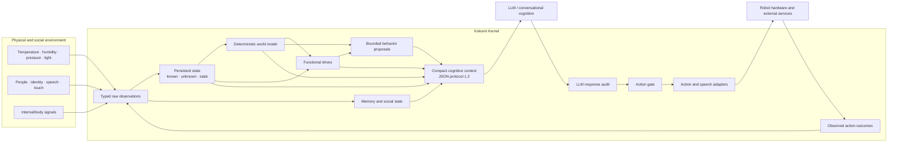
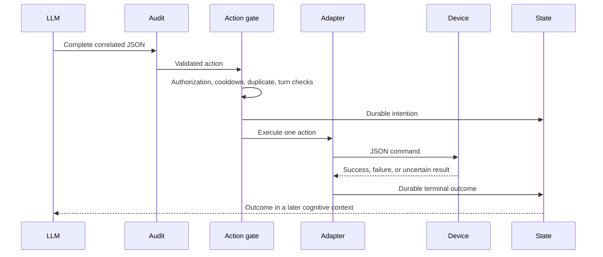

# Kokomi Kernel


[](https://github.com/taka-k22/kokomi_kernel/actions/workflows/test.yml?query=branch%3Acodex%2Fbehavior-architecture)


Kokomi Kernel is the embodied-state and action-control layer for the Waifu 3.0 research platform. It converts real-world observations into persistent state, derives an explicit world model, supplies bounded cognitive context to an LLM, and closes the loop by recording the actual outcome of physical or external actions.

The Kernel exists to support research on how physical and physiological functions affect human–robot interaction. It is an experimental control and measurement substrate, not a general-purpose assistant framework.

## System status

| Area | Current state | Operational meaning |
| --- | --- | --- |
| Observation, state, and world model | Implemented | Typed observations become freshness-aware state and deterministic world facts |
| Cognitive protocol | Implemented | Compact JSON protocol 1.2 with correlated turns |
| Memory, social state, and drives | Implemented | Kernel-authoritative long-term state with proposal-based LLM writes |
| Action gate and outcome feedback | Implemented | One audited action per turn, with durable intention/outcome correlation |
| ASR | Implemented | Realtime partial/committed transcription with idempotent committed delivery |
| TTS | Implemented | Audited emotion/intensity mapping, FIFO playback, and typed outcomes |
| Thinking filler | Implemented and armed | Local deterministic clip after slow committed ASR turns |
| Listening backchannel | Implemented but unarmed | Disabled pending acoustic echo-contamination acceptance |
| Spontaneous behavior dispatch | Implemented but unarmed | Proposals are generated by policy but autonomous dispatch is disabled |
| Physical bindings | Partially integrated | BME280, brightness, vision, touch, LED, and tear paths exist; new body hardware remains planned |

## Architectural model



### Authority boundaries

- Sensors and adapters own raw observations.
- The Kernel owns persistent physical state, world facts, action history, accepted memory, accepted social boundaries, and drive state.
- The LLM owns conversational interpretation and response selection for the current turn.
- Behavior proposals are options presented to cognition; they are never direct actuator commands.
- A requested action is not treated as completed until an execution outcome returns to the Kernel.
- Missing or stale evidence becomes `unknown`, not an inferred `false`.

## Runtime composition

| Component | Responsibility |
| --- | --- |
| `alice.js` | Runtime composition, HTTP surface, browser bridge, polling, execution dispatch, and service lifecycle |
| `src/behavior/` | Observation validation, state reduction, world derivation, drives, proposals, turns, persistence, and action gating |
| `src/protocol/` | Strict audit of LLM response objects |
| `src/memory/` | Durable proposal-based memory with bounded retrieval |
| `src/social/` | Relationships, boundaries, commitments, and proposal decisions |
| `src/speech/` | ASR ingestion, capture coordination, echo suppression, TTS, fillers, and exclusive audio playback |
| `dashboard/` | Operational status, events, manual action controls, and integrated microphone UI |
| `realtime_stt.html` | Browser ASR surface served by the Kernel |
| `control_prompt.md` | Executable LLM-side behavioral and protocol policy |
| `config.json` | Runtime policy, thresholds, routes, providers, cooldowns, and safety limits |
| `test/` | Behavioral, protocol, persistence, safety, and speech regression contract |

Historical experiments and superseded design material are isolated under [`archives/`](archives/README.md).

## Observation contract

Every accepted external event is normalized into a typed observation envelope:

```json
{
  "id": "obs_<uuid>",
  "type": "interaction.user_input",
  "source": "user_input_api",
  "observed_at": "ISO-8601 timestamp",
  "payload": {
    "text": "Hello"
  }
}
```

The observation layer enforces bounded identifiers, timestamps, payload shape, and source semantics before state mutation. Unsafe externally supplied identifiers and malformed values are rejected.

### Active observation families

| Family | Representative events | State effect |
| --- | --- | --- |
| Environment | BME280 and brightness samples | Temperature, humidity, pressure, and brightness facts |
| Vision | Person recognized, unknown, enrolled, or disappeared | Occupancy and visible-person state |
| Audio | Sound label and level | Last sound, quietness, and speaking activity |
| Touch | Petting started or ended | Contact state and touched body parts |
| Interaction | Typed or committed spoken user input | Current interaction and cognitive trigger |
| Homeostasis | Named normalized internal signals | Kernel drive inputs |
| Speech output | TTS and filler lifecycle events | Current output state and recovery diagnostics |
| Action | Intention and terminal outcome | Agency state and prediction match |

## Persistent state

State facts retain:

- value and unit;
- `known`, `unknown`, or stale status;
- observation time and source;
- confidence;
- originating observation ID;
- subsystem-specific metadata such as visible people or touched body parts.

Freshness policy is explicit:

| Evidence class | Freshness window |
| --- | ---: |
| Temperature, humidity, and pressure | 15 s |
| Brightness | 15 s |
| Sound classification | 5 s |
| Person evidence | 5 min |
| Touch evidence | 30 s |

When the applicable window expires, downstream facts lose certainty. The Kernel does not silently reinterpret expired evidence as a negative observation.

## World model

The world model is derived deterministically from state and includes provenance or an explicit reason for uncertainty.

| Derived fact | Source facts | Current rule |
| --- | --- | --- |
| Room occupancy | Fresh person evidence | Mirrors confirmed presence; otherwise unknown |
| Thermal condition | Temperature | Cold below 18 °C; warm from 27 °C; hot from 31 °C; otherwise comfortable |
| Lighting condition | Brightness | Dark below 40; bright from 75; otherwise normal |
| Environment quietness | Sound level | Quiet for `quiet` or `low`; otherwise false when known |
| Someone talking | Sound label | True only when the current known label is `speech` |
| Character being petted | Touch state | Mirrors fresh petting state |
| Last action status | Action outcome | Derived from the latest terminal outcome |

Rule-based derivation keeps the model inspectable and prevents free-form LLM text from becoming authoritative physical state.

## Drives and spontaneous behavior

The drive layer represents functional pressure rather than character dialogue.

### Current drives

- `thermal_comfort`: derived from the thermal world condition.
- `social_contact`: grows with time since meaningful interaction, is reduced when a person is present, and resets while the character is being petted.
- `sensory_rest`: increases under medium, high, or loud sound.
- external body signals: normalized values supplied by `internal.homeostasis_sample`.

Social contact reaches its configured maximum after four hours without meaningful interaction. External body signals expire after five minutes.

### Proposal types

The spontaneous engine can propose:

- greeting a newly visible person;
- responding to petting;
- mentioning uncomfortable temperature;
- considering lighting when the occupied room is dark;
- considering regulation of a dominant homeostatic drive.

Each proposal carries an ID, priority, reason, compact context, expiry time, cooldown key, and `cognitive_review_required` execution policy. Proposals expire after 30 seconds. Autonomous dispatch is currently disabled and unarmed.

## Cognitive context protocol

The Kernel sends one compact object per cognitive turn:

```json
{
  "type": "cognitive_context",
  "protocol_version": "1.2",
  "turn_id": "obs_<uuid>",
  "trigger": {},
  "persona": {},
  "state": {},
  "world": {},
  "memory": [],
  "social": {},
  "drives": {},
  "last_action_outcome": {},
  "behavior_proposals": []
}
```

Optional blocks are omitted when empty. High-volume provenance remains in Kernel storage; the LLM receives a compact projection sufficient for the current decision.

The configured persona is `kokomi-origin`. Persona content is delivered at session bootstrap, while its ID and compact version are carried in later contexts.

### Turn correlation

- Every LLM response must reference a currently pending `turn_id`.
- At most 32 turns may remain pending.
- A pending turn expires after five minutes.
- A valid response can consume a turn only once.
- Retries may reuse prepared context without creating a second cognitive turn.

## LLM response protocol

An LLM response is accepted only as one complete JSON object. Unknown fields, incomplete objects, invalid ranges, and uncorrelated turns are rejected before side effects.

### Top-level fields

| Field | Requirement |
| --- | --- |
| `turn_id` | Required; must match a pending cognitive context |
| `speech` | Optional non-empty string, maximum 2,000 characters |
| `emotion` | Required exactly when `speech` exists |
| `intensity` | Required exactly when `speech` exists; finite number from 0.0 to 1.0 |
| `actions` | Optional array with at most one item |
| `requests` | Optional array with at most five items |
| `memory_proposals` | Optional proposal array; remains pending until Kernel acceptance |
| `social_proposals` | Optional proposal array; remains pending until Kernel acceptance |

At least one effective speech, action, or request must be present.

### Emotions

`neutral`, `happy`, `calm`, `sad`, `angry`, `surprised`, `fear`, and `thinking`.

### Actions

| Type | Exact parameters | Constraints |
| --- | --- | --- |
| `tear` | `speed`, `duration` | Both integers from 0 to 255 |
| `led_change` | `color` | `#RRGGBB` |
| `bluesky_post` | `text` | Non-empty, maximum 300 characters |
| `remember_person` | `track_id`, `name` | Valid visible track; bounded non-control-character name |

Public posting and face enrollment require current-turn authorization. Negative or ambiguous language never grants authorization. Spontaneous turns cannot execute unarmed external actions.

### Requests

String sensor requests are `temperature`, `humidity`, `pressure`, and `brightness`.

Object requests are:

- `vision` with the exact task `describe_scene`;
- `kernel_query` for `state`, `world`, `drives`, `social`, `memory`, or `action`.

Memory queries require a non-empty query string. Other query text is optional and limited to 500 characters.

## Memory and social state

The Kernel uses a hybrid authority model:

- the LLM retains short conversational context;
- the Kernel stores durable, inspectable memory and social state;
- LLM output may propose new records but cannot directly make them authoritative;
- accepted near-duplicate memories supersede older records without deleting history;
- social boundaries constrain later action decisions;
- commitments remain explicit and inspectable.

Memory retrieval is bounded to five relevant records per context. Stored records include evidence event IDs and confidence, preserving the distinction between grounded memory and conversational invention.

## Action gate and outcome feedback

The action path is:



The gate permits at most one action per turn. Duplicate requests are suppressed for 30 seconds, with action-specific cooldowns:

| Action | Cooldown |
| --- | ---: |
| Tear | 10 s |
| LED change | 2 s |
| Bluesky post | 5 min |
| Remember person | 1 min |

An unfinished intention recovered after restart becomes an explicit unknown/interrupted outcome. The system never converts a mere request into evidence that an actuator actually succeeded.

## Voice I/O

### ASR

The active provider is ElevenLabs Scribe realtime using Japanese and VAD commit.

- Partial transcripts update transient state and the UI only.
- Partial state expires after two seconds and is excluded from cognitive context.
- A committed transcript creates exactly one normal user-input turn.
- Segment and event IDs make committed delivery idempotent.
- Failed delivery may retry the prepared turn without creating another turn.
- Token issuance is restricted to loopback clients.

### TTS

Audited `speech`, `emotion`, and `intensity` are mapped to ElevenLabs request settings.

- Speech text is not rewritten by the adapter.
- Emotion mapping is deterministic.
- Intensity interpolates bounded stability and style values.
- Playback is FIFO.
- Disabled, completed, HTTP-failed, playback-failed, and interrupted states remain distinguishable.
- A failed item does not block the next queued utterance.
- Provider failures are sanitized before entering state.

### Self-voice suppression

Main TTS and thinking fillers use coordinated half-duplex capture:

1. The Kernel requests browser ASR capture pause.
2. Playback waits up to 650 ms for pause acknowledgement.
3. The audible output owns the shared playback lane.
4. ASR events received during the pause are rejected by the Kernel.
5. After playback, capture resumes following a 400 ms guard using a fresh single-use token.
6. A text-similarity echo guard provides an additional fallback.

This control is designed to prevent Kokomi's own voice from becoming a committed user turn.

### Local fillers

Fillers are local WAV clips validated by a versioned manifest.

| Policy | Thinking filler | Listening backchannel |
| --- | --- | --- |
| Enabled | Yes | Yes |
| Armed | Yes | No |
| Trigger | Slow response after committed ASR | Sustained user partial speech |
| Delay / minimum speech | 1,000 ms delay | 1,800 ms speech |
| Per-turn or per-segment maximum | 1 | 1 |
| Cooldown | 4 s global | 6 s listening |
| Semantic commitment | None | Attention only |

Main semantic TTS has priority over thinking filler, which has priority over listening backchannel. Playback leases prevent simultaneous ownership of the audible output lane. Filler lifecycle events are persisted and never create an LLM turn.

## Perception and physical integration

| Interface | Current binding | Semantics |
| --- | --- | --- |
| BME280 | Active, one-second polling | Temperature, humidity, and pressure |
| CdS brightness | Active, one-second polling | Raw brightness and lighting condition |
| Vision / DeepSort | Active HTTP event input | Resolved identity, enrollment, and disappearance |
| Camera snapshot | Active on-demand request | Image attached to the same LLM vision turn |
| Touch | Active event input | Bound body part and petting lifecycle |
| Audio classification | Active event input | Sound label, level, confidence, quietness, and speech activity |
| LED | Active action output | Audited `#RRGGBB` command and returned outcome |
| Tear actuator | Active action output | Audited speed/duration command and returned outcome |
| Bluesky | Active guarded action | Explicitly authorized public post |
| Face enrollment | Active guarded action | Explicitly authorized track-to-name binding |
| Nine-axis IMU | Planned | Motion and posture observations |
| eFlesh | Planned | Contact location, intensity, and duration |
| Ethanol cell and flow path | Planned | Calibrated physiological measurement and flow-state observations |
| Sneeze classifier | Planned | Environment-specific event recognition rather than generic YAMNet dependence |

## HTTP surface

| Method | Route | Function |
| --- | --- | --- |
| GET | `/` | Operations dashboard |
| GET | `/asr` | Integrated realtime ASR page |
| POST | `/api/asr/token` | Loopback-only short-lived ASR token |
| POST | `/asr/transcript` | Partial or committed ASR event |
| GET | `/api/asr/control` | Server-sent capture-control stream |
| POST | `/api/asr/control/ack` | Capture pause/resume acknowledgement |
| GET | `/api/dashboard/status` | Operational service and state snapshot |
| GET | `/api/dashboard/events` | Recent event stream |
| POST | `/api/dashboard/actions` | Guarded manual LED or tear action |
| POST | `/yolo_event` | Resolved person event |
| POST | `/touch_sensor_input` | Touch lifecycle event |
| POST | `/audio_classification` | Sound classification event |
| POST | `/internal_state` | Normalized homeostatic signals |
| GET | `/api/behavior/state` | State, world, drives, social state, action state, and proposals |
| POST | `/api/behavior/tick` | Explicit behavior evaluation tick |
| GET | `/api/memory/proposals` | Pending memory proposals |
| POST | `/api/memory/proposals/:id/decision` | Accept or reject a memory proposal |
| GET | `/api/social/proposals` | Pending social proposals |
| POST | `/api/social/proposals/:id/decision` | Accept or reject a social proposal |
| POST | `/user_input` | Typed user input and normal cognitive-turn creation |

The runtime server listens on port 3000.

## Persistence and recovery

- Durable semantic observations are appended to `data/runtime/observations.jsonl`.
- High-rate sensor values are checkpointed at one-minute intervals instead of logging every sample.
- Startup replay is bounded to 20,000 events.
- Replay rebuilds state without replaying old spontaneous proposals.
- Incomplete TTS, filler, and action intentions are reconciled into explicit terminal diagnostic states.
- Accepted memory and social records use separate runtime stores.
- Runtime data is intentionally excluded from source control.

## Operational observability

The dashboard exposes:

- service health and degradation;
- latest typed state and derived world facts;
- pending behavior proposals;
- action intentions and outcomes;
- TTS, filler, and ASR capture state;
- recent endpoint activity and errors;
- manual guarded LED and tear actions.

Events preserve turn, observation, output, and intention identifiers so latency and causal chains can be reconstructed.

## Safety invariants

1. No malformed or unknown LLM field reaches an adapter.
2. No LLM response executes without a valid pending turn.
3. No turn executes more than one action.
4. No public or identity-changing action is authorized by ambiguous language.
5. No spontaneous turn performs an external action unless explicitly armed by policy.
6. No stale sensor fact silently becomes false.
7. No action request is reported as success without a returned outcome.
8. No filler asserts knowledge, agreement, consent, or task completion.
9. No ASR partial becomes durable conversational input.
10. No TTS or filler failure may permanently block the audio queue.

## Verification contract

The current regression suite contains 55 passing tests covering:

- action authorization, cooldowns, one-action limits, and restart diagnostics;
- observation validation, state reduction, freshness, and world derivation;
- behavior proposal priority, expiry, cooldown, leasing, and occupancy safety;
- event checkpointing, replay, and interrupted-output reconciliation;
- cognitive-context projection and correlated LLM response auditing;
- memory and social proposal validation and acceptance;
- ASR partial/committed semantics, token restrictions, retries, and echo suppression;
- TTS emotion/intensity mapping, FIFO recovery, provider failures, and backpressure;
- capture pause acknowledgement and fresh-token resume;
- filler manifest safety, deterministic scheduling, cancellation, exclusivity, and recovery.

## License

The repository is licensed under the [MIT License](LICENSE).
